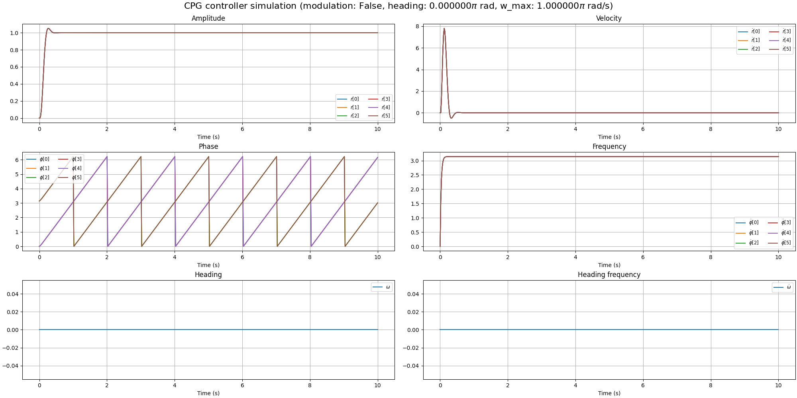
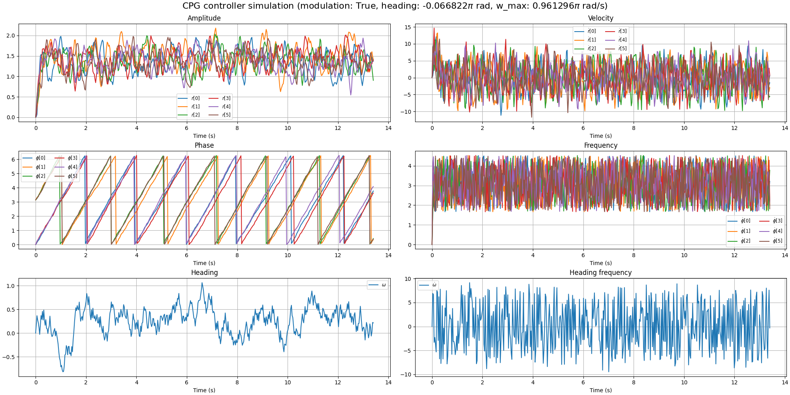
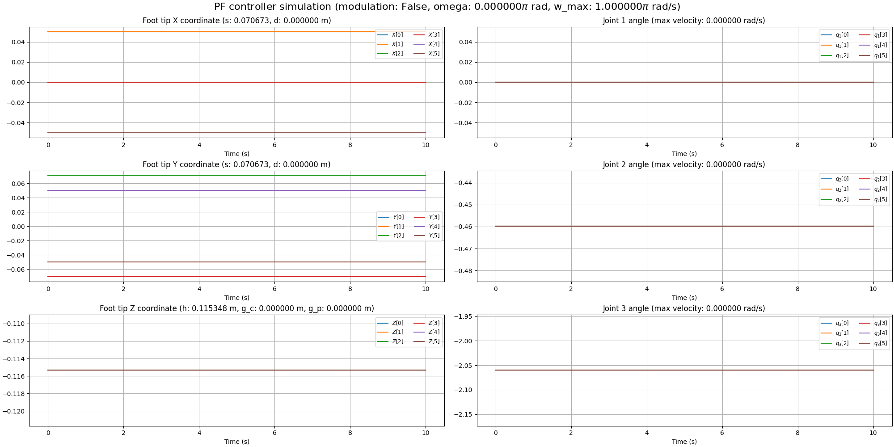
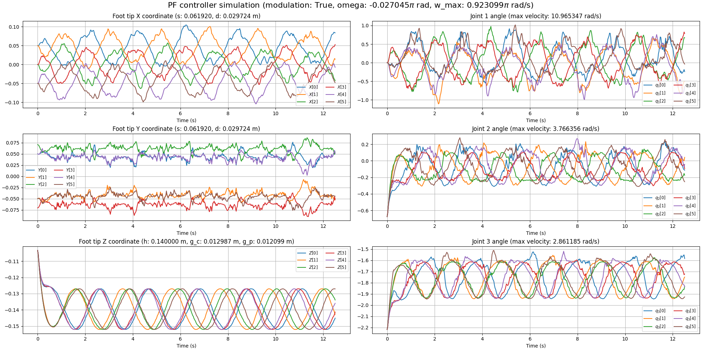

# Neurowalker: CPG-RL-based locomotion control of a six legged robot

**NeuroWalker** is a bio-inspired locomotion control system for a six legged robot. Ultimately it should integrate:

- [ ] **Central Pattern Generators (CPGs)** for rhythmic motion and inter-leg coordination
- [ ] **Torque-emulated position control** for low-cost servo motors
- [ ] **Reinforcement Learning (DRL)** for adaptive, feedback-driven behavior
- [ ] **Actuators failure tolerance** for enchanced reliability of the system
- [ ] A modular design built on **Isaac Lab** with vectorized simulation, multi-agent potential, and custom reward pipelines

The project aims to explore advanced control strategies in legged robotics using a hybrid of classical motor control and neural-inspired learning architectures.

## Installation

- Install Isaac Lab by following the [installation guide](https://isaac-sim.github.io/IsaacLab/main/source/setup/installation/index.html).
  We recommend using the conda installation as it simplifies calling Python scripts from the terminal.

- Clone or copy this project/repository separately from the Isaac Lab installation (i.e. outside the `IsaacLab` directory):
    ```bash
    git clone git@github.com:mazhugich-labs/neurowalker.git
    cd neurowalker/
    ```

- Using a python interpreter that has Isaac Lab installed, install the library in editable mode using:

    ```bash
    # use 'PATH_TO_isaaclab.sh|bat -p' instead of 'python' if Isaac Lab is not installed in Python venv or conda
    python -m pip install -e source/neurowalker

- Verify that the extension is correctly installed by:

    - Listing the available tasks:

        Note: It the task name changes, it may be necessary to update the search pattern `"Template-"`
        (in the `scripts/list_envs.py` file) so that it can be listed.

        ```bash
        # use 'FULL_PATH_TO_isaaclab.sh|bat -p' instead of 'python' if Isaac Lab is not installed in Python venv or conda
        python scripts/list_envs.py
        ```

    - Running a task:

        ```bash
        # use 'FULL_PATH_TO_isaaclab.sh|bat -p' instead of 'python' if Isaac Lab is not installed in Python venv or conda
        python scripts/<RL_LIBRARY>/train.py --task=<TASK_NAME>
        ```

    - Running a task with dummy agents:

        These include dummy agents that output zero or random agents. They are useful to ensure that the environments are configured correctly.

        - Zero-action agent

            ```bash
            # use 'FULL_PATH_TO_isaaclab.sh|bat -p' instead of 'python' if Isaac Lab is not installed in Python venv or conda
            python scripts/zero_agent.py --task=<TASK_NAME>
            ```
        - Random-action agent

            ```bash
            # use 'FULL_PATH_TO_isaaclab.sh|bat -p' instead of 'python' if Isaac Lab is not installed in Python venv or conda
            python scripts/random_agent.py --task=<TASK_NAME>
            ```

## Simulation

### Hopf Network Controller

The controller is based on **phase-coupled oscillators**.  
Each oscillator generates a smooth periodic signal representing the leg trajectory. Coupling between oscillators enforces coordination patterns (gaits), and parameters control the amplitude, frequency, and phase relationships.

#### 1. Simulation & Integration
- **`--dt`**: Controller update rate (seconds).  
- **`--integration-method`**: Integration method for oscillator updates (`"euler"` for speed, `"rk4"` for accuracy).

#### 2. Oscillator Parameters
- **`--a`**: Convergence factor mean — how fast oscillators stabilize to target motion.  
- **`--default-alpha`**: Initial oscillator phases in radians, defining the starting gait (e.g., `(0, π, π, 0, 0, π)` for tripod gait).

#### 3. Amplitude Modulation (μ)
- **`--mu-min`** / **`--mu-max`**: Minimum and maximum oscillation amplitude, affecting step length.

#### 4. Frequency Modulation (ω)
- **`--w-min`** / **`--w-max`**: Minimum and maximum gait frequency (rad/s).

#### 5. Coupling Weights
- **`--self-weight`**: Self-coupling (oscillator stiffness).  
- **`--in-group-weight`**: Coupling between oscillators in the same group.  
- **`--of-group-weight`**: Coupling between oscillators in different groups.  
- **`--threshold`**: Minimal phase difference for grouping oscillators.

#### 6. Computation & Timing
- **`--device`**: `"cpu"` or `"cuda"` for running on CPU or GPU.  
- **`--simulation-time`**: Total simulation time in seconds.

#### 7. Random Modulation
- **`--enable-random-modulation`**: Adds variability for robustness testing.

#### 8. Save Produced Image
- **`--filename`**: Allows to save produced image.

---

#### Quick Reference Table

| Parameter                    | Type / Range     | Default              | Description (CPG Context)                                                                                  |
| ---------------------------- | ---------------- | -------------------- | ---------------------------------------------------------------------------------------------------------- |
| `--dt`                       | float, > 0       | `0.02`               | Controller update step in seconds. Smaller values = smoother but more computation.                         |
| `--integration-method`       | `heun` or `rk4`  | `heun`               | Numerical method for integrating oscillator states. RK4 is more accurate, Heun is faster.                  |
| `--a`                        | float, > 0       | `32`                 | Convergence gain for oscillator phase/amplitude error correction. Higher = faster locking to desired gait. |
| `--default-alpha`            | 6 floats (rad)   | `(0, π, π, 0, 0, π)` | Initial oscillator phase offsets. Default is tripod gait for 6 legs.                                       |
| `--mu-min`                   | float, ≥ 0       | `0.0`                | Minimum allowed amplitude modulation. Controls minimal leg lift.                                           |
| `--mu-max`                   | float, ≥ 0       | `2.0`                | Maximum allowed amplitude modulation. Controls maximum leg lift.                                           |
| `--w-min`                    | float, ≥ 0       | `0.0`                | Minimum oscillator frequency (rad/s). Controls slowest walking speed.                                      |
| `--w-max`                    | float, ≥ 0       | `π`                  | Maximum oscillator frequency (rad/s). Controls fastest walking speed.                                      |
| `--omega-cmd-min`            | float            | `-π`                 | Minimum robot heading change command (rad/s). Negative = left turn.                                        |
| `--omega-cmd-max`            | float            | `π`                  | Maximum robot heading change command (rad/s). Positive = right turn.                                       |
| `--omega-cmd-tau`            | float, > 0       | `0.25`               | Time constant of heading command low-pass filter. Smooths sharp turn commands.                             |
| `--self-weight`              | float            | `0.0`                | Self-coupling gain in the CPG network. Usually left at 0 for standard gait patterns.                       |
| `--in-group-weight`          | float            | `1.0`                | Coupling weight between oscillators in the same gait group (e.g., tripod set).                             |
| `--of-group-weight`          | float            | `0.0`                | Coupling weight between oscillators in different gait groups.                                              |
| `--threshold`                | float, ≥ 0       | `0.0`                | Minimum phase difference to classify oscillators into separate groups.                                     |
| `--device`                   | `cpu` or `cuda`  | `cpu`                | Computing device for simulation/training. Use `cuda` for GPU acceleration.                                 |
| `--simulation-time`          | float, > 0       | `10.0`               | Duration of the CPG simulation in seconds.                                                                 |
| `--enable-random-modulation` | flag             | off                  | Adds random variation to CPG parameters for robustness testing.                                            |
| `--filename`                 | string or `None` | `None`               | Output filename for saving simulation plots/images.                                                        |


---

#### Example Command to Run the Simulation

```bash
python source/neurowalker/neurowalker/test/controllers/test_hopf_network_controller.py \
    --dt 0.027 \
    --integration-method rk4 \
    --a 38.42 \
    --default-alpha 0 3.141592653589793 3.141592653589793 0 0 3.141592653589793 \
    --mu-min 0.12 \
    --mu-max 2.67 \
    --w-min 0.15 \
    --w-max 3.02 \
    --omega-cmd-min -2.41 \
    --omega-cmd-max 2.85 \
    --omega-cmd-tau 0.31 \
    --self-weight 0.07 \
    --in-group-weight 1.46 \
    --of-group-weight 0.34 \
    --threshold 0.21 \
    --device cuda \
    --simulation-time 13.4 \
    --enable-random-modulation \
    --filename hopf_network_controller_random_modulation

```

This will simulate a tripod gait for 10 seconds, using GPU acceleration (--device cuda) and random modulation parameter variations.

#### Example of Command Line Output

```bash
[✓] Starting simulation with the following parameters:

dt                        : 0.027
integration_method        : rk4
a                         : 38.42
default_alpha             : [0.0, 3.141592653589793, 3.141592653589793, 0.0, 0.0, 3.141592653589793]
mu_min                    : 0.12
mu_max                    : 2.67
w_min                     : 0.15
w_max                     : 3.02
omega_cmd_min             : -2.41
omega_cmd_max             : 2.85
omega_cmd_tau             : 0.31
self_weight               : 0.07
in_group_weight           : 1.46
of_group_weight           : 0.34
threshold                 : 0.21
device                    : cuda
simulation_time           : 13.4
enable_random_modulation  : False
filename                  : hopf_network_controller_random_modulation

[✓] Simulation (496 steps, dt=0.027s) completed. Average controller step time: 0.823 ms

[✓] Saving image to: source/neurowalker/docs/images/hopf_network_controller_random_modulation.png
```

#### Example of Images Produced by Hopf Network Controller (no/random modulation)





#### Implementation

You can find Hopf Network Controller source code [*here*](source/neurowalker/neurowalker/controllers/cpg/hopf/).

### Kinematics Controller

Kinematics Controller takes CPG state and morphological parameters (leg stride, robot height, step length, etc.) as inputs and produces target feet positions. Another function takes target foot positions and produces target joint positions.

#### Example of Images Produced by Kinematics Controller (no/random modulation)





#### Implementation

You can find Inverse Kinematics Controller source code [*here*](source/neurowalker/neurowalker/controllers/mechanics/kinematics/)

### Dynamics Controller

- [ ] *TODO*

#### Implementation

You can find Inverse Dynamics Controller source code [*here*](source/neurowalker/neurowalker/controllers/mechanics/dynamics/)

### IsaacSim

IsaacSim simulation of NeuroWalker locomotion via implemented controllers pipeline without external modulation. RL is coming soon...

#### Example of Simulation


**Blue** arrow points to the commanded movement direction, while **yellow** shows actual direction.

#### Implementation

You can find IsaacSim Simulation source code [*here*](source/neurowalker/neurowalker/test/test_isaacsim_neurowalker.py)

## Acknowledgement

- [*Orbit: A Unified Simulation Framework for Interactive Robot Learning Environments*](https://arxiv.org/pdf/2301.04195)

- [*Hierarchical learning control for autonomous robots inspired by central
nervous system*](https://arxiv.org/pdf/2408.03525)

- [*CPG-RL: Learning Central Pattern Generators
for Quadruped Locomotion*](https://arxiv.org/pdf/2211.00458)
