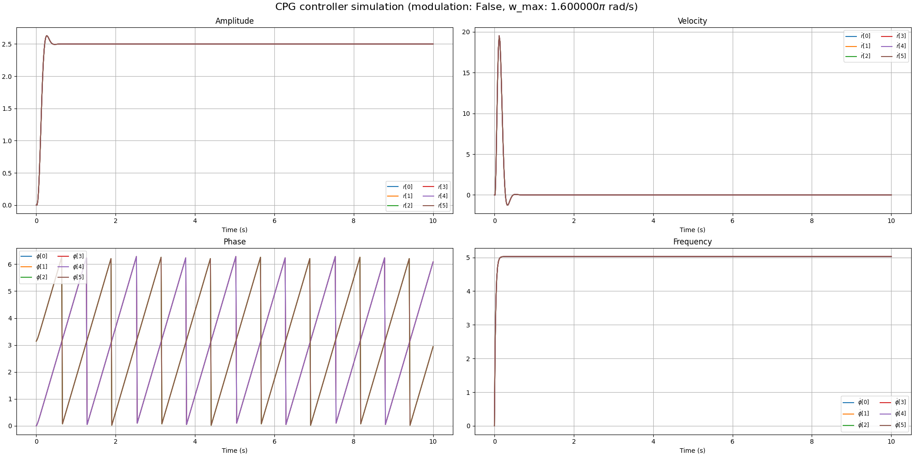
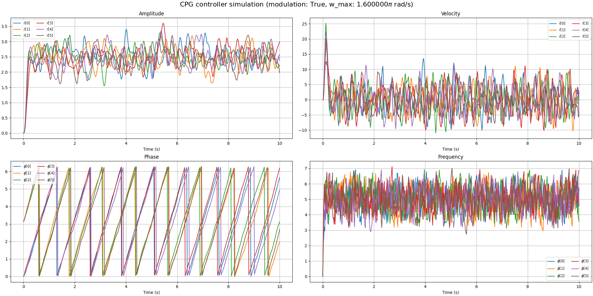

# Neurowalker: CPG-RL-based locomotion control of a six legged robot

**NeuroWalker** is a bio-inspired locomotion control system for a six legged robot. Ultimately it should integrate:

- [ ] **Central Pattern Generators (CPGs)** for rhythmic motion and inter-leg coordination
- [ ] **Torque-emulated position control** for low-cost servo motors
- [ ] **Reinforcement Learning (DRL)** for adaptive, feedback-driven behavior
- [ ] **Actuators failure tolerance** for enchanced reliability of the system
- [ ] A modular design built on **Isaac Lab** with vectorized simulation, multi-agent potential, and custom reward pipelines

The project aims to explore advanced control strategies in legged robotics using a hybrid of classical motor control and neural-inspired learning architectures.

## Installation

- Install Isaac Lab by following the [installation guide](https://isaac-sim.github.io/IsaacLab/main/source/setup/installation/index.html).
  We recommend using the conda installation as it simplifies calling Python scripts from the terminal.

- Clone or copy this project/repository separately from the Isaac Lab installation (i.e. outside the `IsaacLab` directory):
    ```bash
    git clone git@github.com:mazhugich-labs/neurowalker.git
    cd neurowalker/
    ```

- Using a python interpreter that has Isaac Lab installed, install the library in editable mode using:

    ```bash
    # use 'PATH_TO_isaaclab.sh|bat -p' instead of 'python' if Isaac Lab is not installed in Python venv or conda
    python -m pip install -e source/neurowalker

- Verify that the extension is correctly installed by:

    - Listing the available tasks:

        Note: It the task name changes, it may be necessary to update the search pattern `"Template-"`
        (in the `scripts/list_envs.py` file) so that it can be listed.

        ```bash
        # use 'FULL_PATH_TO_isaaclab.sh|bat -p' instead of 'python' if Isaac Lab is not installed in Python venv or conda
        python scripts/list_envs.py
        ```

    - Running a task:

        ```bash
        # use 'FULL_PATH_TO_isaaclab.sh|bat -p' instead of 'python' if Isaac Lab is not installed in Python venv or conda
        python scripts/<RL_LIBRARY>/train.py --task=<TASK_NAME>
        ```

    - Running a task with dummy agents:

        These include dummy agents that output zero or random agents. They are useful to ensure that the environments are configured correctly.

        - Zero-action agent

            ```bash
            # use 'FULL_PATH_TO_isaaclab.sh|bat -p' instead of 'python' if Isaac Lab is not installed in Python venv or conda
            python scripts/zero_agent.py --task=<TASK_NAME>
            ```
        - Random-action agent

            ```bash
            # use 'FULL_PATH_TO_isaaclab.sh|bat -p' instead of 'python' if Isaac Lab is not installed in Python venv or conda
            python scripts/random_agent.py --task=<TASK_NAME>
            ```

## Simulation

### Hopf Network Controller

The controller is based on **phase-coupled oscillators**.  
Each oscillator generates a smooth periodic signal representing the leg trajectory. Coupling between oscillators enforces coordination patterns (gaits), and parameters control the amplitude, frequency, and phase relationships.

#### 1. Simulation & Integration
- **`--dt`**: Controller update rate (seconds).  
- **`--integration-method`**: Integration method for oscillator updates (`"euler"` for speed, `"rk4"` for accuracy).

#### 2. Oscillator Parameters
- **`--a`**: Convergence factor mean — how fast oscillators stabilize to target motion.  
- **`--default-alpha`**: Initial oscillator phases in radians, defining the starting gait (e.g., `(0, π, π, 0, 0, π)` for tripod gait).

#### 3. Amplitude Modulation (μ)
- **`--mu-min`** / **`--mu-max`**: Minimum and maximum oscillation amplitude, affecting step length.

#### 4. Frequency Modulation (ω)
- **`--w-min`** / **`--w-max`**: Minimum and maximum gait frequency (rad/s).

#### 5. Coupling Weights
- **`--self-weight`**: Self-coupling (oscillator stiffness).  
- **`--in-group-weight`**: Coupling between oscillators in the same group.  
- **`--of-group-weight`**: Coupling between oscillators in different groups.  
- **`--threshold`**: Minimal phase difference for grouping oscillators.

#### 6. Computation & Timing
- **`--device`**: `"cpu"` or `"cuda"` for running on CPU or GPU.  
- **`--simulation-time`**: Total simulation time in seconds.

#### 7. Random Modulation
- **`--enable-random-modulation`**: Adds variability for robustness testing.

#### 8. Save Produced Image
- **`--filename`**: Allows to save produced image.

---

### Quick Reference Table

| Argument | Default | Description |
|----------|---------|-------------|
| `--dt` | `0.02` | Controller update rate (seconds). |
| `--integration-method` | `"heun"` | Integration method: `"heun"` or `"rk4"`. |
| `--a` | `10` | Convergence factor mean. |
| `--default-alpha` | `(0, π, π, 0, 0, π)` | Initial phases for oscillators (radians). |
| `--mu-min` | `1.0` | Minimum amplitude. |
| `--mu-max` | `4.0` | Maximum amplitude. |
| `--w-min` | `0.0` | Minimum frequency (rad/s). |
| `--w-max` | `1.6 × π` | Maximum frequency (rad/s). |
| `--self-weight` | `0.0` | Self-coupling weight. |
| `--in-group-weight` | `1.0` | Same-group coupling weight. |
| `--of-group-weight` | `0.0` | Cross-group coupling weight. |
| `--threshold` | `0.0` | Phase difference threshold (rad). |
| `--device` | `"cpu"` | Compute device. |
| `--simulation-time` | `10.0` | Simulation duration (seconds). |
| `--enable-random-modulation` | *disabled* | Enables random modulation. |
| `--filename` | *None* | Filename to save image to. |

---

### Example Command to Run the Simulation

```bash
python source/neurowalker/neurowalker/test/controllers/test_hopf_network_controller.py \
    --dt 0.02 \
    --integration-method rk4 \
    --a 12 \
    --default-alpha 0 3.1416 3.1416 0 0 3.1416 \
    --mu-min 1.0 \
    --mu-max 9.5 \
    --w-min 0.2 \
    --w-max 5.0 \
    --in-group-weight 1.0 \
    --of-group-weight 0.1 \
    --simulation-time 10.0 \
    --device cuda \
    --enable-random-modulation \
    --filename hopf_network_controller_random_modulation
```

This will simulate a tripod gait for 10 seconds, using GPU acceleration (--device cuda) and random modulation parameter variations.

### Example of Command Line Output

```bash
[✓] Starting simulation with the following parameters:

dt                        : 0.02
integration_method        : rk4
a                         : 12.0
default_alpha             : [0.0, 3.1416, 3.1416, 0.0, 0.0, 3.1416]
mu_min                    : 1.0
mu_max                    : 9.5
w_min                     : 0.2
w_max                     : 5.0
self_weight               : 0.0
in_group_weight           : 1.0
of_group_weight           : 0.1
threshold                 : 0.0
device                    : cuda
simulation_time           : 10.0
enable_random_modulation  : True
filename                  : hopf_network_controller_random_modulation

[✓] Simulation (500 steps, dt=0.02s) completed. Average controller step time: 0.915 ms

[✓] Saving image to: source/neurowalker/docs/images/hopf_network_controller_random_modulation.png
```

### Example of Images Produced by Hopf Network Controller (no/random modulation)





### Implementation
You can find Hopf Network Controller source code here:

```bash
.
└── source
    └── neurowalker
        └── neurowalker
            └── controllers
                ├── cpg
                │   ├── hopf_network_controller_cfg.py
                │   ├── hopf_network_controller.py
                │   ├── __init__.py
                │   └── utils.py
                └── __init__.py
```

### Pattern Formation Controller


## Acknowledgement

- [*Orbit: A Unified Simulation Framework for Interactive Robot Learning Environments.*](https://arxiv.org/pdf/2301.04195)

- [*Hierarchical learning control for autonomous robots inspired by central
nervous system*](https://arxiv.org/pdf/2408.03525)
