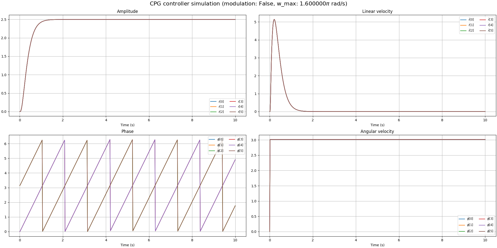
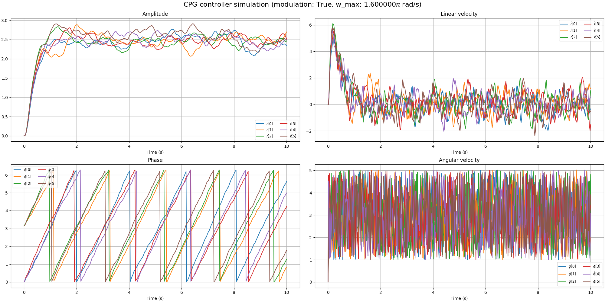

# Neurowalker: CPG-RL-based locomotion control of a six legged robot

**NeuroWalker** is a bio-inspired locomotion control system for a six legged robot. Ultimately it should integrate:

- [ ] **Central Pattern Generators (CPGs)** for rhythmic motion and inter-leg coordination
- [ ] **Torque-emulated position control** for low-cost servo motors
- [ ] **Reinforcement Learning (DRL)** for adaptive, feedback-driven behavior
- [ ] **Actuators failure tolerance** for enchanced reliability of the system
- [ ] A modular design built on **Isaac Lab** with vectorized simulation, multi-agent potential, and custom reward pipelines

The project aims to explore advanced control strategies in legged robotics using a hybrid of classical motor control and neural-inspired learning architectures.

## Installation

- Install Isaac Lab by following the [installation guide](https://isaac-sim.github.io/IsaacLab/main/source/setup/installation/index.html).
  We recommend using the conda installation as it simplifies calling Python scripts from the terminal.

- Clone or copy this project/repository separately from the Isaac Lab installation (i.e. outside the `IsaacLab` directory):
    ```bash
    git clone git@github.com:mazhugich-labs/neurowalker.git
    cd neurowalker/
    ```

- Using a python interpreter that has Isaac Lab installed, install the library in editable mode using:

    ```bash
    # use 'PATH_TO_isaaclab.sh|bat -p' instead of 'python' if Isaac Lab is not installed in Python venv or conda
    python -m pip install -e source/neurowalker

- Verify that the extension is correctly installed by:

    - Listing the available tasks:

        Note: It the task name changes, it may be necessary to update the search pattern `"Template-"`
        (in the `scripts/list_envs.py` file) so that it can be listed.

        ```bash
        # use 'FULL_PATH_TO_isaaclab.sh|bat -p' instead of 'python' if Isaac Lab is not installed in Python venv or conda
        python scripts/list_envs.py
        ```

    - Running a task:

        ```bash
        # use 'FULL_PATH_TO_isaaclab.sh|bat -p' instead of 'python' if Isaac Lab is not installed in Python venv or conda
        python scripts/<RL_LIBRARY>/train.py --task=<TASK_NAME>
        ```

    - Running a task with dummy agents:

        These include dummy agents that output zero or random agents. They are useful to ensure that the environments are configured correctly.

        - Zero-action agent

            ```bash
            # use 'FULL_PATH_TO_isaaclab.sh|bat -p' instead of 'python' if Isaac Lab is not installed in Python venv or conda
            python scripts/zero_agent.py --task=<TASK_NAME>
            ```
        - Random-action agent

            ```bash
            # use 'FULL_PATH_TO_isaaclab.sh|bat -p' instead of 'python' if Isaac Lab is not installed in Python venv or conda
            python scripts/random_agent.py --task=<TASK_NAME>
            ```

## Simulation

As for now [Hopf](https://en.wikipedia.org/wiki/Hopf_bifurcation)-based controller is available.

To run the simulation paste:

```bash
python source/neurowalker/neurowalker/test/controllers/test_low_level_controller.py # --random-command to apply random modulation to the network
```





You can find controllers implementation here:

```bash
.
└── source
    └── neurowalker
        └── neurowalker
            └── controllers
                ├── __init__.py
                └── low_level
                    ├── cpg_hopf_cfg.py
                    ├── cpg_hopf.py
                    └── __init__.py
```

## Acknowledgement

- [*Orbit: A Unified Simulation Framework for Interactive Robot Learning Environments.*](https://arxiv.org/pdf/2301.04195)

- [*Hierarchical learning control for autonomous robots inspired by central
nervous system*](https://arxiv.org/pdf/2408.03525)
